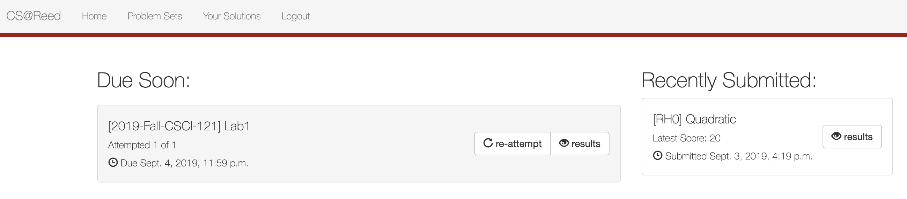
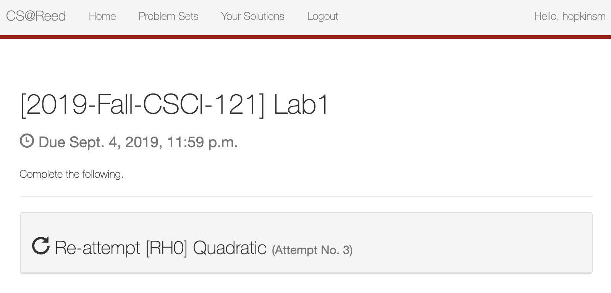
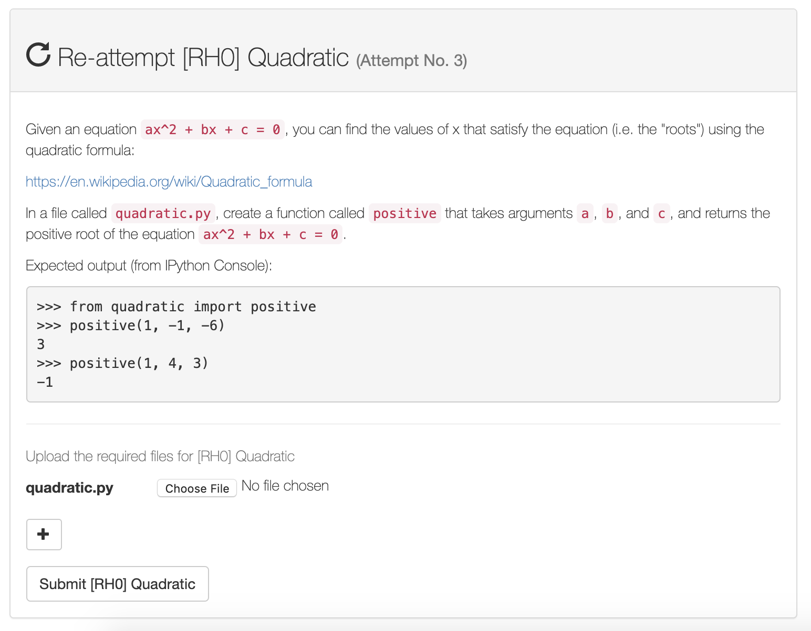
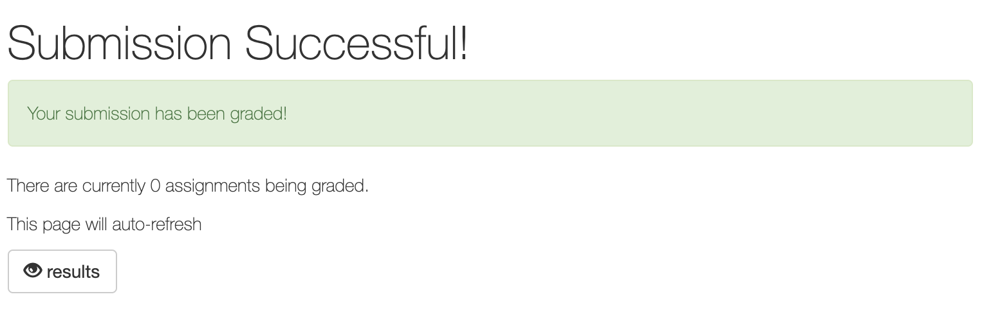
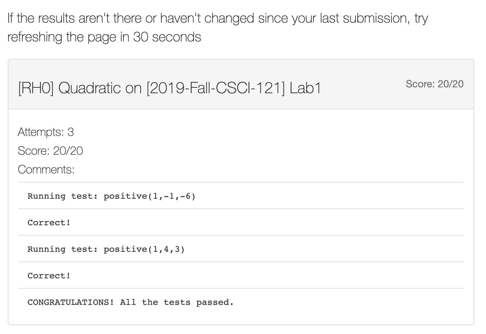

# CSCI 121: Introduction to Computer Science

## Helpful resources (adapted from a document by Rhody Kaner)

### Mentors

We will be assigning each student a mentor who will provide you personalized
feedback for each project as the semester progresses. The list of
available mentors is [here](https://github.com/Mark-Hopkins-at-Reed/csci-121/blob/master/admin/mentors.md).

### Drop-In Tutoring
Drop-in tutoring happens every weekday evening, Sun-Thurs from 7-9pm in 
ETC 211. Come by any time during tutoring hours (even if you don’t have a 
question) to work on assignments around other CS students and get moral 
support from the community. 

### Individual/Small Group Tutoring 
Every Reed student is entitled to one hour per week of individual tutoring
(or more with an accommodation) for every course, and you also have the
option to pool tutoring hours with other students in the class to do
multiple hours of small-group tutoring. Tutoring appointments can be
made at https://iris.reed.edu/tutor/tutors/profiles for any time and place
that works for you and your tutor. Please remember that tutors are busy Reed
students too, and really appreciate it when you try to schedule appointments
at least a few days in advance when possible.

### Professor Office Hours
Eric’s office hours are in Greywood 117 on Tuesday 9am-noon and Wednesday
(only on days **projects** are due) 7pm-midnight.

Mark’s office hours are in Library 382 on Monday 4-6pm and Wednesday 4-6pm.

### DOJO Study Skills Workshops and Coaching
Reed offers a variety of workshops as well as individual coaching to help
you learn study skills, time management, etc. Find info at
https://www.reed.edu/academic_support/index.html

### Polytopia and The Math Lounge
Polytopia (Library 387) and the Math Lounge (Library ) are academic spaces
for students in CS (and math) classes. These spaces are often populated with
other students working on similar coursework (and sometimes upperclassfolk
who can answer your questions), and these rooms are conveniently on the same
hallway as some of the CS professors' offices.

## First steps

This course is taught using Python 3. We recommend the following setup:

1. Go to https://www.anaconda.com/download.
2. Choose whether you're using Windows, Mac, or Linux by clicking on the appropriate icon. This will give you a choice of files to download.

3. Click the big green download button beneath the Python 3.7 version.

## Next steps for Mac users

1. Open the downloaded file, which should be called something like Anaconda3-2018.12-MacOSX-x86_64.pkg.
2. You may be asked whether or not you trust the provider of this file. If so, click "Continue".

3. Follow the remainder of the instructions from the installer (accept the license agreement, etc.) Note that the installation may take several minutes. You need not bother installing Microsoft VSCode (if asked). At the end, feel free to move the installer to the trash (if asked).

4. To launch Anaconda Navigator, open a Finder window and then press Command+Shift+A. This will jump to the Applications menu. From here, open Anaconda Navigator by double-clicking on it.

5. To make it easier to open Anaconda Navigator in the future, you may wish to right-click on the Anaconda icon (a green circle) in the dock at the bottom of the screen. Then go to Options -> Keep in Dock. In the future, this will allow you to open the Anaconda Navigator by clicking on the Anaconda icon in the dock.

6. All done! Proceed to the section on "Using Anaconda Navigator and Spyder".

##  Next steps for Windows users

1. Open the downloaded file, which should be something like Anaconda3.something.exe.
2. Follow the setup prompts, taking all the default recommendations. The installation may take several minutes. You need not bother installing Microsoft VSCode (if asked). 
3. From the Start menu, click the Anaconda Navigator desktop app.

## Using Anaconda Navigator and Spyder

https://docs.anaconda.com/anaconda/user-guide/getting-started/

## Using the autograder

Most of your projects and homeworks will be submitted to an online grading
system. Here we'll go through the steps involved in submitting a homework.

1. Go to cs.reed.edu and login using your Reed credentials.
2. You should see that there is an upcoming assignment due (if not, please
email hopkinsm@reed.edu):

3. Click on "attempt" (or "re-attempt", if you've already submitted a previous
solution). This should lead you to the following screen:

4. Each gray box represents a single exercise. Click on the text in a gray
box to expand the exercise's description.

5. Click on Choose File and find the file you want to submit. Then click on
Submit. You should arrive at the following screen:

6. Click on "results", which brings you to the following screen:

If you see a score of -1, that just means the results aren't quite ready
yet (just reload the page, and it should go away). If you get a perfect
score, then congratulations, you're done! Otherwise, the autograder will
indicate that something is incorrect about your program. Revise it, and
then go through the submission process again until you get it correct.

